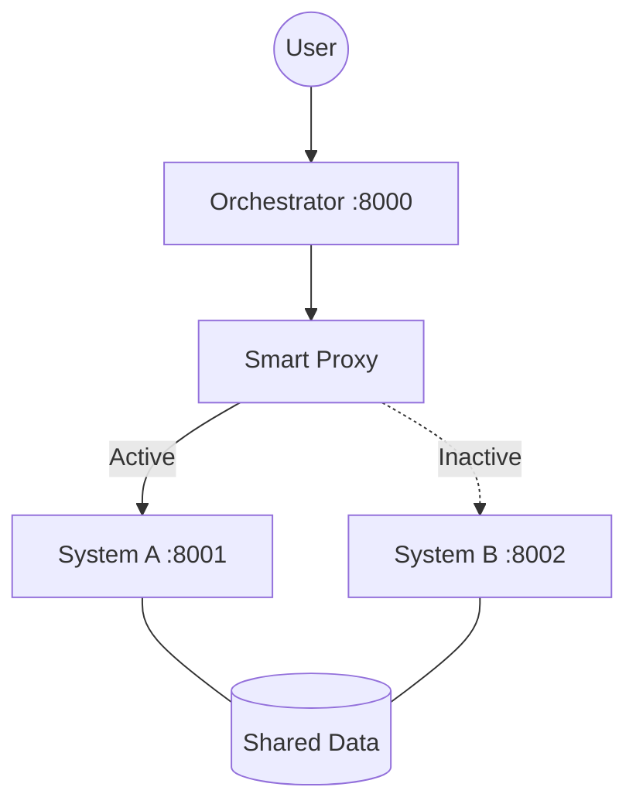

# MartletMolt 🦅

> **A Self-Evolving AI Agent System with A/B Architecture**
>
> MartletMolt 是一個具有「自我修改、自我驗證、零停機進化」能力的 AI Agent 系統。它能在運行中修改自己的程式碼，並在 A/B 兩套系統間無縫切換。

---

## ✨ 核心特點 (Core Features)

- **🔄 自我進化 (Self-Evolving)**：AI 可以根據需求修改自己的原始碼並自動重啟。
- **♻️ 零停機切換 (Zero-Downtime)**：基於 Orchestrator 的流量代理，實現 A/B 系統無縫切換。
- **🛡️ 安全沙盒 (Safety First)**：具體修改在非活躍系統進行，通過測試後才上線。
- **🧩 技能系統 (Skills System)**：動態載入的 Python 技能擴展，讓 Agent 隨時獲取新能力。
- **🕸️ 網頁自動化 (Web Automation)**：內建 Playwright 支援，具備網頁爬取與互動能力。
- **📱 輕量介面 (Web Lite)**：LobeHub 風格的輕量化前端，支援多會話與檔案處理。

---

## 🏗️ 系統架構 (Architecture)



- **Orchestrator**: 系統守護者，負責健康檢查、A/B 切換與檔案同步。
- **System A/B**: 互相備份的後端實體，包含 Agent 核心與工具集。
- **Gateway**: 提供 RESTful API 與 WebSocket 雙向通訊。

---

## ⚙️ 環境變數配置 (Environment Variables)

專案使用 `Pydantic Settings` 管理配置，可透過 `.env` 檔案或環境變數注入。

### 🔑 LLM API 金鑰
| 變數名稱 | 說明 | 參考 |
| :--- | :--- | :--- |
| `OPENAI_API_KEY` | OpenAI API 金鑰 (用於 GPT 系列模型) | 必填 (若使用) |
| `ANTHROPIC_API_KEY` | Anthropic API 金鑰 (用於 Claude 系列模型) | 必填 (若使用) |
| `OLLAMA_API_KEY` | Ollama/Proxy API 金鑰 (通用接入點) | 必填 (若使用) |

### 🛠️ 系統核心配置 (前綴 `MARTLET_`)
| 變數名稱 | 說明 | 預設值 |
| :--- | :--- | :--- |
| `MARTLET_SYSTEM_NAME` | 當前系統標籤 (`a` 或 `b`) | `a` |
| `MARTLET_DEBUG` | 是否開啟偵錯模式 | `false` |
| `MARTLET_LOG_LEVEL` | 日誌層級 (`DEBUG`, `INFO`, `ERROR`) | `INFO` |

### 🌐 網路與代理
| 變數名稱 | 說明 | 預設值 |
| :--- | :--- | :--- |
| `MARTLET_GATEWAY__HOST` | API 伺服器監聽地址 | `0.0.0.0` |
| `MARTLET_GATEWAY__PORT` | API 伺服器監聽連接埠 | `8001` |
| `MARTLET_PROVIDERS__OLLAMA__BASE_URL` | Ollama API 位址 | - |

---

## 🚀 快速啟動 (Quick Start)

1. **安裝依賴** (Python 3.11+):
   ```bash
   make install
   ```

2. **配置環境**:
   - 參照 `Config/settings.yaml` 配置系统項。
   - 建立 `.env` 檔案並填入上述 [環境變數](#環境變數配置-environment-variables)。

3. **啟動全套系統**:
   ```bash
   make dev
   ```
   這將啟動以下服務：
   - **Backend (Active)**: http://localhost:8001
   - **Frontend**: http://localhost:8002

4. **運行 CLI 測試**:
   ```bash
   python -m martlet_molt.main chat
   ```

---

## 📅 開發進度 (Development Roadmap)

- [x] **Phase 1: 核心架構** (系統雙工、LLM 接入、基礎工具)
- [x] **Phase 2: 進化機制** (A/B 切換、Code Rewriter、自動測試)
- [x] **Phase 3: 使用者體驗** (Web Lite V2, 多會話支援, 思考過程視覺化)
- [ ] **Phase 4: 安全強化** (ARCH-001 雙容器安全沙盒) - *下一階段重點*
- [ ] **Phase 5: 自動化測試套件** (確保進化不退化)

---

## 📄 授權協議 (License)

[MIT License](LICENSE)

---
> *MartletMolt: 像毛球換羽一樣不斷進化的 AI 系統。*
